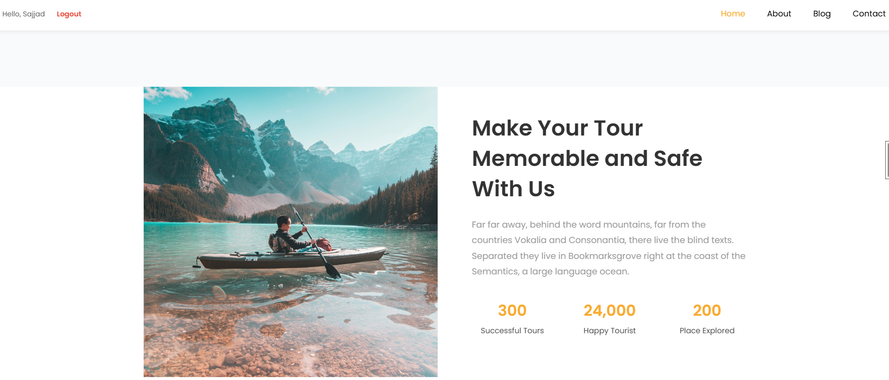

# Django Travel Blog

A full-featured travel blog web application built with Django.

## About The Project

Django Travel Blog is a travel-focused blog platform where users can explore travel destinations, read blog posts, search content, browse posts by categories and tags, and interact with the website.

The project was developed as a final Django project with a focus on authentication, content management, SEO fundamentals, security, and responsive web design.

## Features

- User registration and authentication
- Login and logout
- Travel blog posts
- Categories
- Tags
- Search functionality
- Comments
- CAPTCHA protection
- Recent posts
- Travel information pages
- Contact page
- About page
- Sitemap
- Robots.txt support
- Static and media file handling
- Django admin panel
- Responsive interface

## Technologies

- Python
- Django
- SQLite
- HTML5
- CSS3
- JavaScript
- Bootstrap
- Django Templates

## Django Packages

- django-debug-toolbar
- django-extensions
- django-simple-captcha
- django-multi-captcha-admin
- django-robots
- django-taggit
- Pillow

## Project Structure

```text
django-travel-blog/
│
├── accounts/
├── blog/
├── website/
├── settings/
│   ├── base.py
│   ├── dev.py
│   └── prod.py
│
├── templates/
├── statics/
├── media/
├── manage.py
├── Procfile
├── requirements.txt
└── .gitignore

## Screenshots

### Home Page



### Blog

.png)

### Contact

.png)

### Blog Detail

.png)